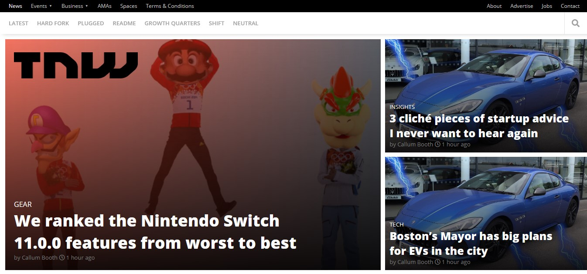

# The-Next-Web

A clone of [TNW](https://ourandco.github.io/The-Next-Web/)'s home page. The website is build using the modern `css`, `html` and media queries techniques to make it responsive.

The website is fully responsive with the help of two `media query` `breakpoints` namely: `< 768px`, `>= 768px`, `>= 1024px`.

## Built With

- HTML5
- CSS3

## Live Demo

[Live Demo Link](https://ourandco.github.io/The-Next-Web/)

## Getting Started

**Clone the project and feel free to make changes.**

## Authors

- Alamgir
- Jackson Karume

👤 **Author1**

- GitHub: [@ourandco](https://github.com/ourandco)

👤 **Author2**

- GitHub: [@sempermort](https://github.com/sempermort)

## 🤝 Contributing

Contributions, issues, and feature requests are welcome!

Feel free to check the [issues page](issues/).

## Show your support

Give a ⭐️ if you like this project!

## Acknowledgments

- Hat tip to [The Next Web](https://thenextweb.com/) for their awesome landing page.
- Hat tip to Microverse for their `README` template.

## 📝 License

This project is [MIT](lic.url) licensed.
